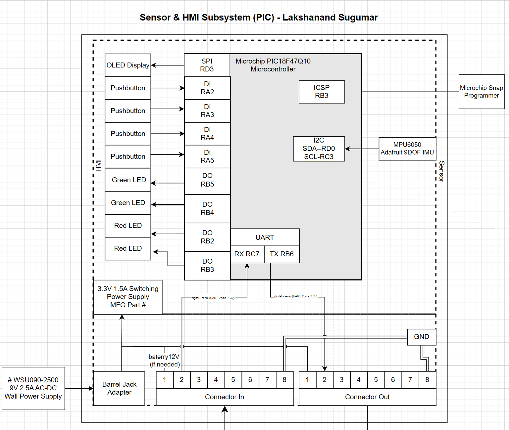

## Objectives

The objective of this assignment is to document the electrical architecture of the **Sensor & Human–Machine Interface (HMI) subsystem** for **Amphibot V1**, and to clearly define how this subsystem interfaces with teammate-designed boards. This block diagram establishes subsystem-level organization, identifies selected components, and documents chip-to-chip and board-to-board connections.

By organizing the subsystem at the block-diagram level, this document supports component selection, schematic development, and clear communication of design intent to teammates and instructional staff. This document will be updated prior to design review as the design matures.

## Overview

This block diagram represents the **Sensor & HMI subsystem** for **Team 302 – R6 Recon Amphibot (Amphibot V1)**, based on the selected **Concept 3** system architecture. The subsystem is built around a **Microchip PIC18F47Q10 microcontroller** and is responsible for acquiring sensor data, providing operator feedback, handling local user input, and communicating with other system modules.

The diagram highlights how regulated power, sensing, user interaction, and communication are integrated to support **fast deployment**, **simple operation**, and **strong situational awareness** in hazardous environments. Emphasis is placed on clear signal flow, correct peripheral usage, and well-defined interfaces with upstream and downstream teammate boards.

Key features shown include:

- **Power supplies:** A 12 V external source regulated to a 3.3 V rail for logic, sensors, and HMI components
- **Sensors:** An IMU connected via I²C for motion and orientation data
- **Human–Machine Interface:** OLED display, pushbuttons, and a status LED for low-cognitive-load interaction
- **Communication:** UART interface for structured data exchange with other subsystems
- **Programming & Debug:** ICSP interface for in-circuit serial programming using a Microchip SNAP
- **Team interfaces:** Standard upstream and downstream ribbon cable connectors for power and signal sharing

## Block Diagram Description

### Microcontroller

- **Microcontroller:** Microchip PIC18F47Q10
- **Peripherals used:**
  - I²C (IMU, OLED display)
  - Digital Inputs (pushbuttons)
  - Digital Output (status LED)
  - UART (inter-module communication)
  - ICSP (programming and debugging)

Each peripheral is shown as a sub-block within the microcontroller, with associated pin assignments indicated.

### Power Architecture

- **Input Power:** 12 V DC wall adapter via barrel jack
- **Regulation:** 3.3 V, 1.5 A switching regulator
- **Distribution:** 3.3 V supplied to the microcontroller, IMU, OLED display, and digital I/O circuitry

Dashed-line voltage boxes indicate the power domains used within the subsystem.

### Sensors

- **IMU:**
  - Interface: Digital Serial (I²C, 2 signal pins, bidirectional)
  - Function: Motion and orientation sensing for hazard awareness

### Human–Machine Interface

- **OLED Display:**
  - Interface: Digital Serial (I²C, 2 signal pins)
  - Function: Visual feedback of system state and hazard information

- **Pushbuttons:**
  - Interface: Digital Input (1 signal pin per button)
  - Function: Local user input and mode selection

- **Status LED:**
  - Interface: Digital Output (1 signal pin)
  - Function: Immediate visual system-state indication

### Communication Interfaces

- **UART:**
  - Interface: Digital Serial (UART, 2 signal pins: TX/RX)
  - Function: Communication with other Amphibot subsystems

- **ICSP:**
  - Interface: In-Circuit Serial Programming
  - Function: Firmware programming and debugging via Microchip SNAP

### External Interfaces

- **Upstream Ribbon Cable Connector:**
  - Provides power and communication signals from upstream teammate board

- **Downstream Ribbon Cable Connector:**
  - Routes regulated power and selected communication signals to downstream teammate board

Standard ribbon cable pins and team-specific connections are clearly identified.

## Block Diagram

