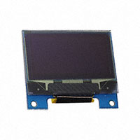
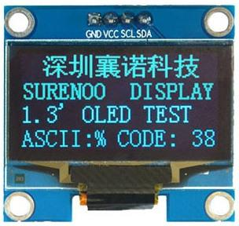
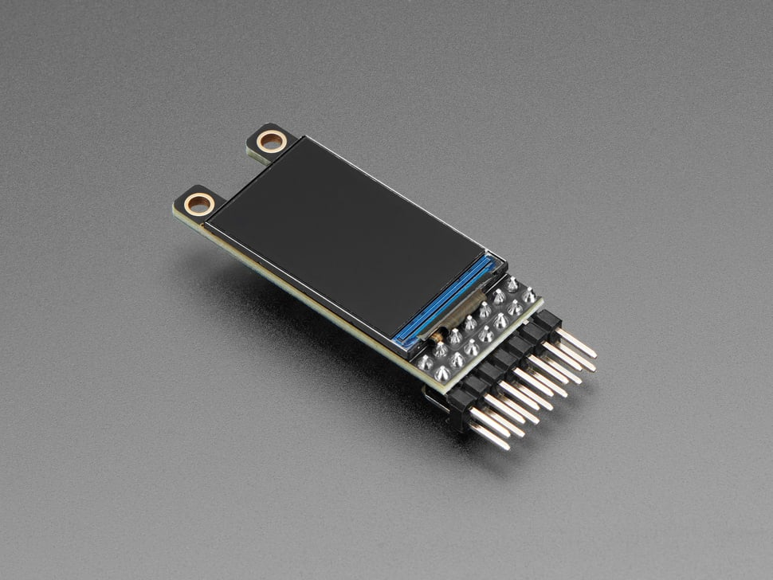
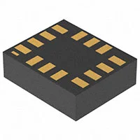
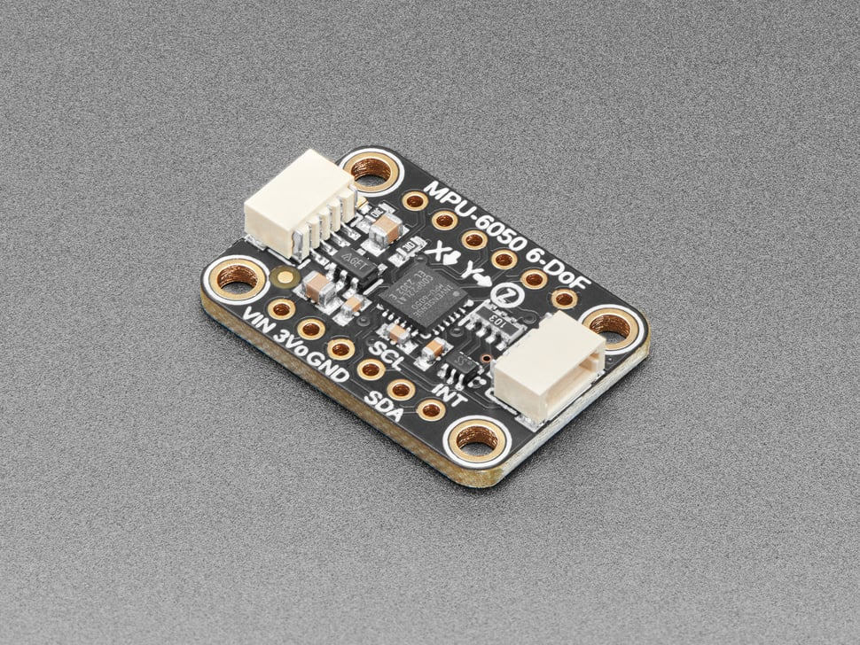
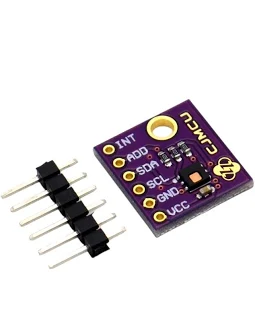
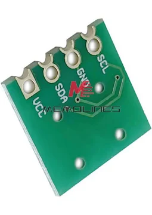
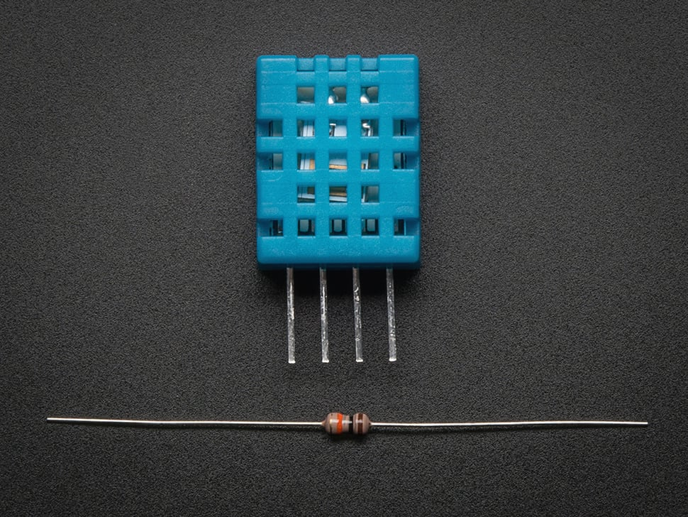
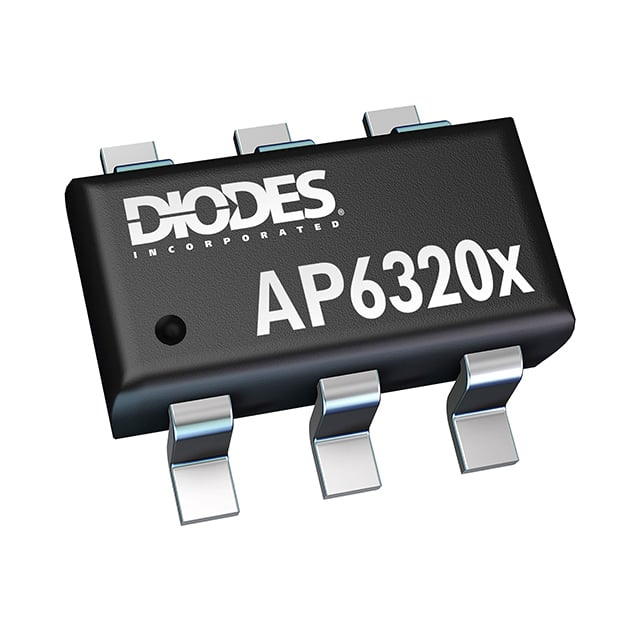
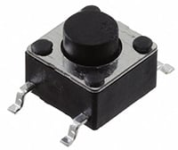

# Sensor & HMI Subsystem — Component Selection

This page documents the component selection process for the Sensor & HMI module of the R6 Recon Amphibot. For each major component, three options were evaluated against the subsystem requirements. The selected component for each category reflects what was fabricated and used in the final V1 prototype demonstrated at the Innovation Showcase.

---

# 1. Microcontroller

## Option 1 — PIC18F57K42 ✅ Selected

| Specification     | Details                                                                                                    |
| ----------------- | ---------------------------------------------------------------------------------------------------------- |
| Architecture      | 8-bit PIC18                                                                                                |
| Flash             | 128 KB                                                                                                     |
| RAM               | 8 KB                                                                                                       |
| Peripherals       | UART, I²C, SPI, PWM, ADC                                                                                   |
| Operating Voltage | 2.3–3.6 V                                                                                                  |
| Package           | QFN-48                                                                                                     |
| Price             | ≈ $2.85                                                                                                    |
| Datasheet         | [PIC18F57K42](https://ww1.microchip.com/downloads/en/DeviceDoc/PIC18F27-47-57K42-Data-Sheet-40001919G.pdf) |

**Pros**

- Large flash and RAM for an 8-bit MCU — comfortably fits OLED framebuffer and UART packet buffers
- Full peripheral set: dedicated UART, hardware I²C, SPI, multiple timers
- 3.3 V native operation matches the system power rail directly
- Supported by Microchip SNAP programmer and MCC Melody code generation

**Cons**

- QFN-48 package requires reflow soldering
- Hardware I²C peripheral had a conflict on the fabricated board, requiring software bit-bang I²C as a workaround

## Option 2 — PIC18F47Q10

| Specification | Details     |
| ------------- | ----------- |
| Architecture  | 8-bit PIC18 |
| Flash         | 128 KB      |
| Package       | TQFP-44     |
| Price         | ≈ $2.60     |

**Pros** — TQFP package is hand-solderable; well documented

**Cons** — Fewer hardware peripherals than the 57K42; lower RAM headroom for framebuffer operations

## Option 3 — ATmega328P

| Specification | Details   |
| ------------- | --------- |
| Architecture  | 8-bit AVR |
| Flash         | 32 KB     |
| Price         | ≈ $2.20   |

**Pros** — Extremely well documented; Arduino ecosystem

**Cons** — Not a PIC-family device; incompatible with course ICSP toolchain and MCC Melody; lower flash and RAM

**Selected:** PIC18F57K42

**Rationale:** The PIC18F57K42 was selected for its larger memory footprint, full peripheral set, and direct compatibility with the Microchip SNAP programmer and MCC Melody framework used throughout the course. Despite the hardware I²C issue encountered post-fabrication, all I²C communication was successfully handled via a software bit-bang implementation with no functional impact.

---

# 2. OLED Display

## Option 1 — 0.96" 128×64 SSD1306 (I²C)

| Specification | Details                                               |
| ------------- | ----------------------------------------------------- |
| Resolution    | 128×64                                                |
| Interface     | I²C / SPI                                             |
| Voltage       | 3.3 V compatible                                      |
| Price         | ≈ $2.00                                               |
| Product Page  | [Adafruit #326](https://www.adafruit.com/product/326) |

**Pros** — Extremely common; extensive library support; low power

**Cons** — 0.96" screen is difficult to read from arm's length during a demo; some modules default to I²C with limited SPI option

## Option 2 — 1.3" 128×64 SH1106 (I²C) ✅ Selected

| Specification | Details                                                 |
| ------------- | ------------------------------------------------------- |
| Resolution    | 128×64                                                  |
| Interface     | I²C (software bit-bang, shared bus with BNO055)         |
| Voltage       | 3.3 V compatible                                        |
| Price         | ≈ $6.50                                                 |
| Datasheet     | [SH1106](https://www.pololu.com/file/0J1813/SH1106.pdf) |

**Pros** — Larger 1.3" panel improves readability; I²C allows shared bus with BNO055; no backlight required; low power consumption

**Cons** — Monochrome only; slightly larger PCB footprint than 0.96" variant

## Option 3 — 1.14" 240×135 ST7789 Color TFT (SPI)

| Specification | Details                                                 |
| ------------- | ------------------------------------------------------- |
| Resolution    | 240×135                                                 |
| Interface     | SPI                                                     |
| Voltage       | 3.3 V logic                                             |
| Price         | ≈ $17.00                                                |
| Product Page  | [Adafruit #4313](https://www.adafruit.com/product/4313) |

**Pros** — Full color; high resolution; wide viewing angles

**Cons** — Significantly higher cost; increased firmware complexity; higher current draw; SPI would consume additional GPIO pins

**Selected:** 1.3" SH1106 over software I²C

**Rationale:** The SH1106 provides a meaningfully larger viewing area than the SSD1306 at modest additional cost. Using I²C allows the display to share the same software bit-bang bus as the BNO055, keeping GPIO usage low. The monochrome limitation is acceptable given that the display only needs to render text-based telemetry and a hazard indicator.

---

# 3. IMU

## Option 1 — ICM-42688-P (6-Axis)

| Specification | Details                                                                                                  |
| ------------- | -------------------------------------------------------------------------------------------------------- |
| Axes          | 6-DOF (Accel + Gyro)                                                                                     |
| Interface     | I²C / SPI                                                                                                |
| Sample Rate   | > 1 kHz                                                                                                  |
| Price         | ≈ $4.70                                                                                                  |
| Datasheet     | [ICM-42688-P](https://invensense.tdk.com/wp-content/uploads/2020/04/ds-000347_icm-42688-p-datasheet.pdf) |

**Pros** — Very high sample rate; low noise; FIFO buffer reduces CPU overhead; power-efficient

**Cons** — Small LGA package is difficult to hand-solder; no magnetometer; requires manual sensor fusion for orientation output

## Option 2 — BNO055 (9-DOF with onboard fusion) ✅ Selected

| Specification | Details                                                                                          |
| ------------- | ------------------------------------------------------------------------------------------------ |
| Axes          | 9-DOF (Accel + Gyro + Mag)                                                                       |
| Interface     | I²C                                                                                              |
| I²C Address   | 0x28 (ADR pin = GND)                                                                             |
| Output        | Euler angles, quaternions, linear acceleration                                                   |
| Price         | ≈ $35.00                                                                                         |
| Datasheet     | [BNO055](https://cdn-learn.adafruit.com/assets/assets/000/125/776/original/bst-bno055-ds000.pdf) |

**Pros** — Onboard ARM Cortex-M0 runs sensor fusion internally; delivers ready-to-use Euler angles and quaternions directly; eliminates need for Kalman or Madgwick filter in firmware; I²C interface integrates cleanly on shared bus

**Cons** — Highest cost of the three options; larger package footprint; requires a short calibration period after power-on

## Option 3 — MPU-6050 (6-Axis)

| Specification | Details |
| ------------- | ------- |
| Axes          | 6-DOF   |
| Interface     | I²C     |
| Price         | ≈ $3.50 |

**Pros** — Very low cost; widely supported; simple I²C interface

**Cons** — Older architecture with higher noise floor; no magnetometer; no onboard fusion — all orientation math must be implemented in firmware on the PIC

**Selected:** BNO055

**Rationale:** The BNO055's onboard sensor fusion processor offloads all orientation computation from the PIC18F57K42, delivering clean Euler angles directly over I²C. This significantly simplified firmware development and reduced the risk of computation errors in the hazard scoring pipeline. The cost premium is justified by the reduction in firmware complexity and the reliability of the fusion output during the showcase demonstration.

---

# 4. Temperature & Humidity Sensor

## Option 1 — HDC2080 (TI) ✅ Selected

| Specification     | Details                                                  |
| ----------------- | -------------------------------------------------------- |
| Interface         | I²C                                                      |
| Temp Accuracy     | ±0.2°C typical                                           |
| Humidity Accuracy | ±2% RH                                                   |
| Voltage           | 1.62–3.6 V                                               |
| Price             | ≈ $3.75                                                  |
| Datasheet         | [HDC2080](https://www.ti.com/lit/ds/symlink/hdc2080.pdf) |

**Pros** — High accuracy; I²C integrates on shared bus; interrupt output pin for threshold alerts; low current draw (< 1 µA standby)

**Cons** — Slightly higher cost than DHT11/AHT21; WSON-6 package requires reflow

## Option 2 — AHT21

| Specification | Details                                                                        |
| ------------- | ------------------------------------------------------------------------------ |
| Interface     | I²C                                                                            |
| Price         | ≈ $2.20                                                                        |
| Datasheet     | [AHT21](https://www.aosong.com/userfiles/files/media/Data%20Sheet%20AHT21.pdf) |

**Pros** — Lower cost; I²C compatible

**Cons** — Lower accuracy than HDC2080; less mature driver ecosystem; fixed I²C address limits bus flexibility

## Option 3 — DHT11

| Specification | Details     |
| ------------- | ----------- |
| Interface     | Single-wire |
| Price         | ≈ $1.50     |

**Pros** — Cheapest option; widely available

**Cons** — Single-wire protocol requires a separate bit-bang implementation distinct from I²C; low accuracy (±2°C, ±5% RH); slow 1 Hz maximum sample rate; through-hole only

**Selected:** HDC2080

**Rationale:** The HDC2080 provides the highest accuracy of the three options and communicates over I²C, allowing it to share the software bit-bang bus already in use for the BNO055 and SH1106. Its interrupt output pin was used to flag out-of-range temperature and humidity conditions for inclusion in the hazard score. The sensor was functional on the V1 board and contributed environmental data to the UART telemetry stream throughout the showcase.

---

# 5. 3.3 V Switching Regulator

## AP63203WU-7 ✅ Selected

| Specification       | Details                                                                                     |
| ------------------- | ------------------------------------------------------------------------------------------- |
| Output Voltage      | 3.3 V fixed                                                                                 |
| Max Output Current  | 3 A                                                                                         |
| Input Voltage Range | 3.8–32 V                                                                                    |
| Switching Frequency | 1.5 MHz                                                                                     |
| Package             | TSOT-26                                                                                     |
| Price               | ≈ $1.50                                                                                     |
| Datasheet           | [AP63203WU-7](https://www.diodes.com/assets/Datasheets/AP63200-AP63201-AP63203-AP63205.pdf) |

**Pros** — Fixed 3.3 V output simplifies design; 3 A rating provides substantial headroom above subsystem load; high switching frequency allows small external inductors and capacitors; TSOT-26 package is compact and hand-solderable

**Cons** — Requires careful PCB layout to minimize switching noise; external inductor and bulk capacitors add component count

**Rationale:** The AP63203WU-7 was selected for its generous current headroom, fixed output voltage, and straightforward application circuit. With the PIC18F57K42, BNO055, SH1106, and HDC2080 drawing well under 200 mA combined, the 3 A rating ensures the regulator operates well within its thermal comfort zone during normal operation.

---

# 6. User Input — Tactile Switch

## 6×6 mm SMD Tactile Switch ✅ Selected

| Specification     | Details                                                                                  |
| ----------------- | ---------------------------------------------------------------------------------------- |
| Type              | Momentary pushbutton, normally open                                                      |
| Mounting          | Surface-mount                                                                            |
| Actuation Force   | ≈ 160 gF                                                                                 |
| Quantity on Board | 2                                                                                        |
| Price             | ≈ $0.30 each                                                                             |
| Datasheet         | [6×6 mm Tact Switch](https://www.schurter.com/en/datasheet/typ_6x6_mm_tact_switches.pdf) |

**Rationale:** Two SMD tactile switches provide local operator input for mode selection and manual event triggering. Both are handled via interrupt-driven firmware with software debouncing. The SMD footprint keeps the board compact and consistent with the all-SMD assembly approach used across the subsystem.

---

# Final Component Selection Summary

| Component       | Part           | Manufacturer      | Key Specs                     | Unit Price | Status        |
| --------------- | -------------- | ----------------- | ----------------------------- | ---------- | ------------- |
| Microcontroller | PIC18F57K42    | Microchip         | 8-bit, 128 KB flash, 3.3 V    | $2.85      | ✅ Fabricated |
| OLED Display    | SH1106 1.3"    | Sino Wealth       | 128×64, I²C                   | $6.50      | ✅ Fabricated |
| IMU             | BNO055         | Bosch             | 9-DOF, onboard fusion, I²C    | $35.00     | ✅ Fabricated |
| Temp/Humidity   | HDC2080        | Texas Instruments | I²C, ±0.2°C, interrupt output | $3.75      | ✅ Fabricated |
| Regulator       | AP63203WU-7    | Diodes Inc.       | 3.3 V, 3 A buck               | $1.50      | ✅ Fabricated |
| Tactile Switch  | 6×6 mm SMD     | TBD               | Momentary, NO                 | $0.30 ×2   | ✅ Fabricated |
| Status LEDs     | 0805 SMD       | TBD               | 3.3 V compatible              | $0.10 ×2   | ✅ Fabricated |
| UART Connector  | 2×4 IDC Header | TBD               | Ribbon cable interface        | $0.50      | ✅ Fabricated |

**Estimated Total Core Component Cost: ≈ $51–$54 per board**
_(excluding passives, PCB fabrication, and shipping)_

> **Note on I²C bus sharing:** The BNO055, SH1106, and HDC2080 all share a single software bit-bang I²C bus on the PIC18F57K42. Each device has a unique I²C address (BNO055: 0x28, SH1106: 0x3C, HDC2080: 0x40), so no address conflicts exist. Bus transactions are arbitrated in firmware with the display framebuffer transfer scheduled between sensor read cycles to avoid contention.
