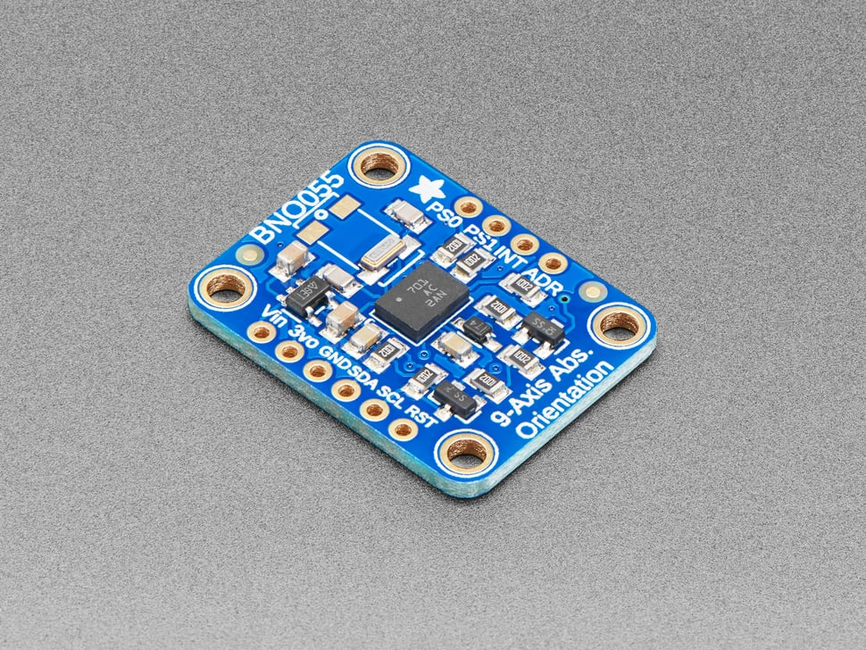

# PIC (HMI + Sensor Subsystem) — Component Selection

---

# 1. OLED Display (HMI Output)

## Option 1 — 0.96" 128×64 SSD1306 OLED (SPI/I²C)

| Specification | Details                              |
| ------------- | ------------------------------------ |
| Resolution    | 128×64                               |
| Interface     | SPI / I²C                            |
| Voltage       | 3.3V compatible                      |
| Price         | ≈ $2.00                              |
| Product Page  | https://www.adafruit.com/product/326 |

### Pros

- Extremely common with strong library support (u8g2, Adafruit)
- Very low power consumption
- Simple interface (I²C or SPI)
- Compact footprint

### Cons

- Small display area limits UI readability
- Limited graphical capability
- Some variants ship configured for I²C only

---

## Option 2 — 1.3" 128×64 SH1106 / SSD1309 SPI OLED

| Specification | Details                                       |
| ------------- | --------------------------------------------- |
| Resolution    | 128×64                                        |
| Interface     | SPI                                           |
| Voltage       | 3.3V compatible                               |
| Price         | ≈ $6.50                                       |
| Product Page  | https://www.pololu.com/product/3760           |
| Datasheet     | https://www.pololu.com/file/0J1813/SH1106.pdf |

### Pros

- Larger screen improves readability for hazard alerts
- SPI interface allows faster refresh than I²C
- Low power (no backlight required)
- Good contrast for indoor use

### Cons

- Slightly larger PCB footprint
- Must verify driver compatibility (SH1106 vs SSD1306)
- Monochrome only

---

## Option 3 — 1.3" 240×135 ST7789 SPI Color TFT (IPS)

| Specification | Details                                             |
| ------------- | --------------------------------------------------- |
| Resolution    | 240×135                                             |
| Interface     | SPI                                                 |
| Voltage       | 3.3V logic                                          |
| Price         | ≈ $17.00                                            |
| Product Page  | https://www.adafruit.com/product/4313               |
| Library       | https://github.com/adafruit/Adafruit-ST7735-Library |

### Pros

- Color graphics and better UI visualization
- Higher resolution
- Wide viewing angles (IPS)
- Strong Arduino/PIC driver support

### Cons

- Higher power draw due to backlight
- More complex firmware
- Requires backlight current management

---

**Selected Display:** Option 2 — 1.3" SPI OLED

---

# 2. IMU (Accelerometer + Gyroscope, ≥50 Hz)

## Option 1 — ICM-42688-P (6-Axis IMU)

| Specification | Details                                                                                   |
| ------------- | ----------------------------------------------------------------------------------------- |
| Axes          | 6 (Accel + Gyro)                                                                          |
| Interface     | I²C / SPI                                                                                 |
| Sample Rate   | >1 kHz                                                                                    |
| Price         | ≈ $4.70                                                                                   |
| Datasheet     | https://invensense.tdk.com/wp-content/uploads/2020/04/ds-000347_icm-42688-p-datasheet.pdf |

### Pros

- Very high sample rates
- Low noise and high precision
- FIFO buffering reduces MCU load
- Low power modes available

### Cons

- QFN package is harder to solder
- No built-in magnetometer

---

## Option 2 — BNO055 (9-DOF with onboard fusion)

| Specification | Details                                                                                |
| ------------- | -------------------------------------------------------------------------------------- |
| Axes          | 9-DOF                                                                                  |
| Interface     | I²C                                                                                    |
| Price         | ≈ $12.00                                                                               |
| Datasheet     | https://cdn-learn.adafruit.com/assets/assets/000/125/776/original/bst-bno055-ds000.pdf |

### Pros

- Built-in sensor fusion
- Outputs orientation directly
- Simplifies firmware

### Cons

- More expensive
- Larger footprint
- Fusion startup delay

---

## Option 3 — MPU-6050 (6-Axis IMU)

| Specification | Details |
| ------------- | ------- |
| Axes          | 6-DOF   |
| Interface     | I²C     |
| Price         | ≈ $3.50 |

### Pros

- Very common and inexpensive
- Strong community support
- Simple I²C interface

### Cons

- Older generation sensor
- Higher noise compared to modern parts
- Limited long-term availability

---

**Selected IMU:** ICM-42688-P

---

# 3. Temperature & Humidity Sensor

## Option 1 — HDC2080 (TI)

| Specification | Details                                       |
| ------------- | --------------------------------------------- |
| Interface     | I²C                                           |
| Voltage       | 1.62–3.6V                                     |
| Price         | ≈ $3.75                                       |
| Datasheet     | https://www.ti.com/lit/ds/symlink/hdc2080.pdf |

---

## Option 2 — AHT21

| Specification | Details                                                               |
| ------------- | --------------------------------------------------------------------- |
| Interface     | I²C                                                                   |
| Price         | ≈ $2.20                                                               |
| Datasheet     | https://www.aosong.com/userfiles/files/media/Data%20Sheet%20AHT21.pdf |

---

## Option 3 — DHT11

| Specification | Details     |
| ------------- | ----------- |
| Interface     | Single-wire |
| Price         | ≈ $1.50     |

---

**Selected Sensor:** HDC2080

---

# 4. User Input (Tactile Switch)

## 6×6mm SMD Tactile Switch

| Specification | Details                                                            |
| ------------- | ------------------------------------------------------------------ |
| Type          | Momentary pushbutton                                               |
| Mounting      | Surface-mount                                                      |
| Price         | ≈ $0.30                                                            |
| Datasheet     | https://www.schurter.com/en/datasheet/typ_6x6_mm_tact_switches.pdf |

---

# 5. 3.3V Switching Regulator

## AP63203WU-7 (3A Buck Converter)

| Specification | Details                                                                      |
| ------------- | ---------------------------------------------------------------------------- |
| Output        | 3.3V                                                                         |
| Current       | 3A                                                                           |
| Price         | ≈ $1.50                                                                      |
| Datasheet     | https://www.diodes.com/assets/Datasheets/AP63200-AP63201-AP63203-AP63205.pdf |

---

# Final Component Selection Summary

| Subsystem       | Component      | Manufacturer | Key Specs             | Price |
| --------------- | -------------- | ------------ | --------------------- | ----- |
| Microcontroller | PIC18F47Q10    | Microchip    | 8-bit MCU, 3.3V logic | $2.60 |
| OLED Display    | 1.3" SPI OLED  | TBD          | 128×64, SPI           | $6.50 |
| IMU             | ICM-42688-P    | TDK          | 6-axis, FIFO          | $4.70 |
| Temp/Humidity   | HDC2080        | TI           | I²C, low power        | $3.75 |
| Regulator       | AP63203WU-7    | Diodes Inc.  | 3A Buck               | $1.50 |
| Button          | 6×6mm SMD      | TBD          | Momentary             | $0.30 |
| LEDs            | 0805 SMD       | TBD          | 3.3V compatible       | $0.10 |
| Interface       | 2×4 IDC Header | TBD          | UART ribbon           | $0.50 |

---

## Estimated Total Core Component Cost

**≈ $20–$23 per board**  
(excluding passives, PCB fabrication, and shipping)
