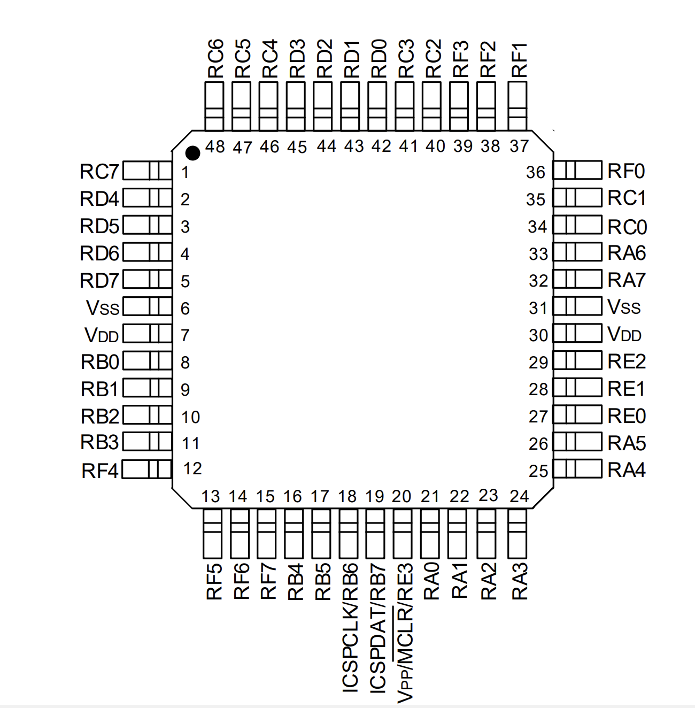
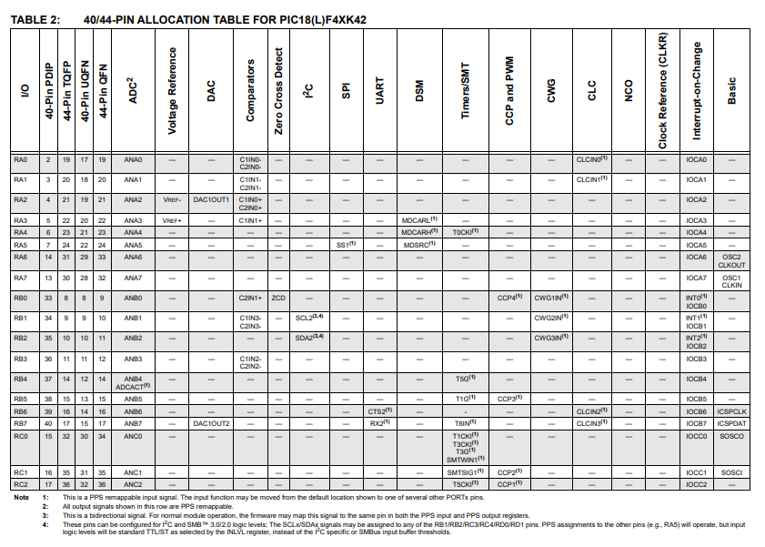
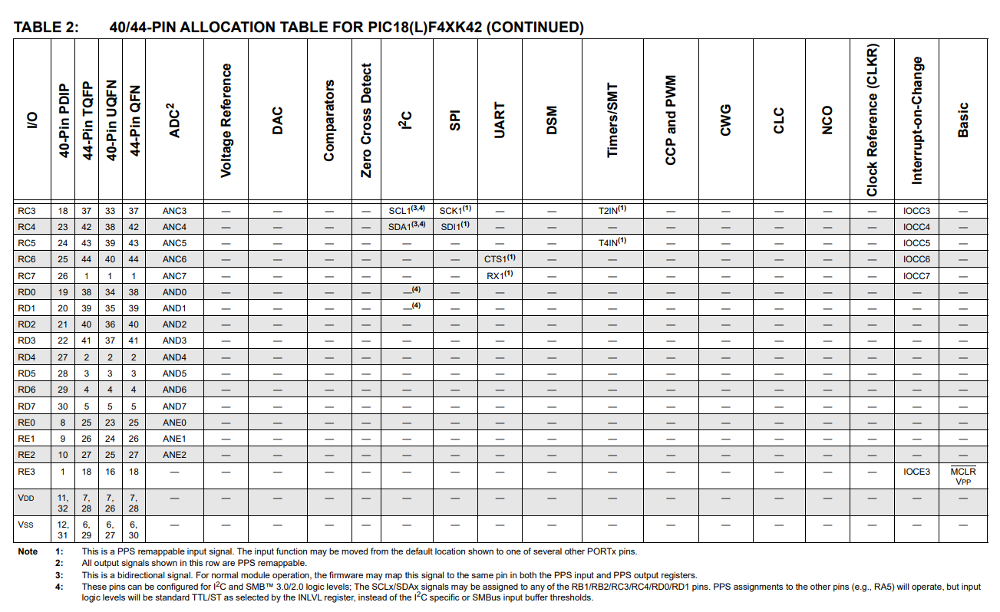
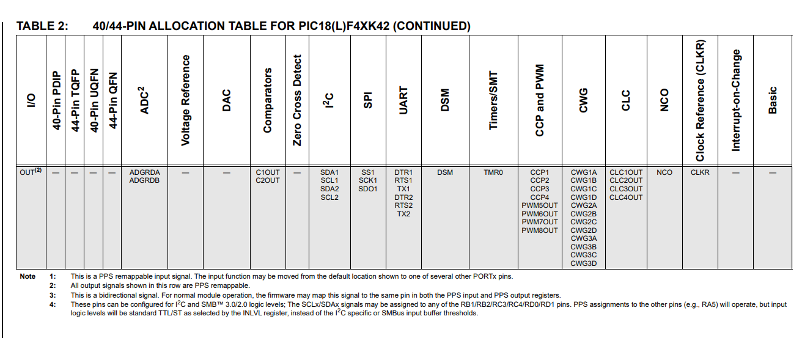

# PIC18F47K42 — Sensor + HMI Subsystem

# 1. Microcontroller Selection

## Selected Microcontroller

**PIC18F47K42 (40-Pin PDIP)**

---

## Why PIC18F47K42?

The subsystem requires:

- I2C communication (MPU6050 + HDC2080)
- SPI communication (OLED)
- Multiple GPIO (LEDs + switches)
- ICSP programming/debug support (MPLAB SNAP)
- 3.3V operation
- DIP package for prototyping simplicity
- Class Requirement

The PIC18F47K42 satisfies all requirements with sufficient I/O margin and hardware peripheral support.

---

# 2. PIC Pin Layout

Below is the official pin layout of the PIC18F47K42 (40-pin DIP):

This confirms:

- Dual VDD and VSS pins
- ICSP pins (RB6, RB7)
- Multiple PORTA, PORTB, PORTC, PORTD pins
- MSSP (I2C/SPI) capability

---

# 3. Pin Allocation Diagrams

## Pin Allocation Overview — Part 1

---

## Pin Allocation Overview — Part 2

---

## Pin Allocation Overview — Part 3

---

# 4. System Overview

The subsystem contains:

1. 3.3V Buck Regulator
2. PIC18F47K42 Microcontroller
3. OLED Display (SPI)
4. HDC2080 Temperature/Humidity Sensor (I2C)
5. MPU6050 IMU (I2C)
6. 4 Tactile Switches
7. 4 Indicator LEDs
8. MPLAB SNAP Programming Header

All logic operates at **3.3V**.

# 5. Power Architecture

## Input

- +12V Barrel Jack
- Fuse protection

## Regulation

- Buck regulator → 3.3V output

## Decoupling

- 22µF bulk capacitors
- 0.1µF near each MCU VDD
- 0.1µF near sensors

# 6. Peripheral Configuration

## I2C Bus (Shared)

| Signal | MCU Pin |
| ------ | ------- |
| SCL    | RC3     |
| SDA    | RD0     |

Pull-ups:

- 4.7kΩ to 3.3V (single pair shared)

Connected Devices:

- MPU6050
- HDC2080

## SPI Bus (OLED)

| Signal | MCU Pin |
| ------ | ------- |
| SCK    | RC5     |
| MOSI   | RC7     |
| CS     | RA5     |
| DC     | RA4     |
| RES    | RA3     |

OLED powered at 3.3V.

## Switches (4x)

Each switch:

- 4.7kΩ pull-up to 3.3V
- Switch connects to GND
- Default = HIGH
- Pressed = LOW

| Switch | MCU Pin |
| ------ | ------- |
| SW1    | RB0     |
| SW2    | RB1     |
| SW3    | RB2     |
| SW4    | RB3     |

No floating inputs.

## LEDs (4x)

Each LED uses 220Ω series resistor.

| LED  | MCU Pin |
| ---- | ------- |
| LED1 | RA2     |
| LED2 | RA3     |
| LED3 | RA4     |
| LED4 | RA5     |

---

## ICSP — MPLAB SNAP

| SNAP Pin | MCU Pin |
| -------- | ------- |
| PGC      | RB6     |
| PGD      | RB7     |
| MCLR     | Pin 1   |
| VDD      | 3.3V    |
| GND      | GND     |

SNAP connects to **ICSPCLK (RB6)** and **ICSPDAT (RB7)**

---

# 7. Peripheral Usage Summary

| Peripheral | Used      | Purpose      |
| ---------- | --------- | ------------ |
| I2C        | Yes       | Sensors      |
| SPI        | Yes       | OLED         |
| UART       | Available | Expansion    |
| ADC        | Available | Future       |
| WiFi       | No        | Not required |
| USB        | No        | Not required |

---

# 8. Electrical Validation

- No floating GPIO
- Proper pull-ups on I2C
- Proper decoupling capacitors
- Dedicated ICSP lines
- SPI isolated from I2C
- All devices 3.3V compatible

---

# 9. Subsystem Role

This subsystem:

- Reads IMU data (MPU6050)
- Reads temperature & humidity (HDC2080)
- Displays data on OLED
- Reads user button input
- Drives indicator LEDs
- Communicates over hardware I2C and SPI
- Programmed/debugged using MPLAB SNAP

This board does **not** include wireless communication.

---

# 10. Final Justification

The PIC18F47K42:

- Meets all subsystem requirements
- Supports simultaneous I2C and SPI
- Provides adequate GPIO margin
- Uses stable MPLAB toolchain
- Separates cleanly from other team subsystems

The microcontroller selection is technically sufficient and electrically validated.
