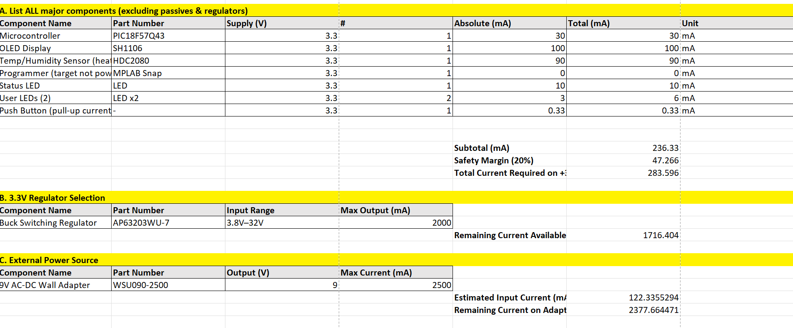

# PIC18F47K42 Sensor & HMI Subsystem — Power Budget

**Laksh — Team 302**

---

# Overview

This document presents the complete power budget analysis for Laksh’s **PIC18F47K42 Sensor & Human–Machine Interface (HMI) subsystem**.

The purpose of this analysis is to verify that:

- All active components on the +3.3V rail are properly accounted for
- Total peak current is calculated using worst-case conditions
- A safety margin is applied
- The selected regulator can safely supply the required current
- The external power source provides adequate headroom

This subsystem operates entirely from a single regulated **+3.3V rail** generated by the **AP63203WU-7 synchronous buck regulator**, powered from a 9V wall adapter (or optional 12V shared battery input).

---

# Power Budget Table



## A. Major Active Components

_(Excluding passives and regulators)_

| Component                         | Part Number | Supply (V) | Qty | Peak (mA) | Total (mA) |
| --------------------------------- | ----------- | ---------- | --- | --------- | ---------- |
| Microcontroller                   | PIC18F47K42 | 3.3        | 1   | 30        | 30         |
| OLED Display                      | SH1106      | 3.3        | 1   | 100       | 100        |
| Temperature/Humidity Sensor       | HDC2080     | 3.3        | 1   | 0.7       | 0.7        |
| IMU                               | MPU6050     | 3.3        | 1   | 3.9       | 3.9        |
| Status LED                        | LED         | 3.3        | 1   | 10        | 10         |
| User LEDs                         | LED ×2      | 3.3        | 2   | 3         | 6          |
| Switch Pull-Up Current (4x 4.7kΩ) | —           | 3.3        | 4   | 0.7       | 2.8        |

---

## Subtotal Current Calculation

```
PIC18F47K42        = 30.0 mA
SH1106 OLED        = 100.0 mA
HDC2080            = 0.7 mA
MPU6050            = 3.9 mA
LEDs total         = 16.0 mA
Pull-ups total     = 2.8 mA
--------------------------------
Subtotal           ≈ 153.4 mA
```

---

## Safety Margin (20%)

A 20% safety margin is applied to account for:

- Startup surges
- Transient spikes
- Temperature variation
- Component tolerance

```
153.4 mA × 1.20 = 184.08 mA
```

### Total Required Current on +3.3V Rail:

**≈ 185 mA**

---

# B. 3.3V Regulator Selection

| Component                | Part Number | Input Range | Max Output (mA) |
| ------------------------ | ----------- | ----------- | --------------- |
| Buck Switching Regulator | AP63203WU-7 | 3.8V – 32V  | 2000 mA         |

---

## Regulator Headroom Calculation

```
2000 mA - 185 mA = 1815 mA remaining
```

The AP63203WU-7 provides more than **10× the required current**, ensuring:

- Stable operation under full load
- Safe handling of transient spikes
- Strong thermal margin
- Room for future expansion

The regulator is significantly oversized relative to system demand, which improves reliability.

---

# C. External Power Source

## Primary Source

| Power Source          | Part Number | Output | Max Current (mA) |
| --------------------- | ----------- | ------ | ---------------- |
| 9V AC-DC Wall Adapter | WSU090-2500 | 9V DC  | 2500 mA          |

---

## Estimated Input Current to Adapter

Assuming buck converter efficiency ≈ 90%

### Output Power:

```
3.3V × 0.185A ≈ 0.61W
```

### Input Power:

```
0.61W / 0.90 ≈ 0.68W
```

### Input Current from 9V Adapter:

```
0.68W / 9V ≈ 75 mA
```

---

## Adapter Headroom

```
2500 mA - 75 mA ≈ 2425 mA remaining
```

The 9V adapter is substantially oversized relative to actual system demand.

---

# Power Rails and Distribution

| Power Rail | Regulator / Source | Part Number | Output | Max Current | Notes                           |
| ---------- | ------------------ | ----------- | ------ | ----------- | ------------------------------- |
| +3.3V      | Buck Regulator     | AP63203WU-7 | 3.3V   | 2000 mA     | Powers MCU, OLED, sensors, LEDs |
| 9V Input   | Wall Adapter       | WSU090-2500 | 9V     | 2500 mA     | Feeds buck regulator            |

All active components operate from a **single +3.3V regulated rail**, which:

- Simplifies routing
- Reduces conversion losses
- Improves system stability
- Eliminates need for multiple voltage domains

---

# How the Power Budget Informed Design Choices

The power budget confirmed:

- Total required current ≈ 185 mA
- Regulator capacity = 2000 mA
- Regulator headroom ≈ 1815 mA
- Adapter headroom ≈ 2425 mA

This analysis validated:

- The AP63203WU-7 is more than sufficient
- No additional voltage rails are required
- The system has significant margin for future expansion
- The selected power architecture is electrically safe

Compared to high-power wireless subsystems, this PIC-based HMI board has modest current demand and excellent efficiency.

---

# Power Budget Summary

Laksh’s PIC18F47K42 subsystem requires approximately **185 mA on the +3.3V rail** including safety margin.

The selected **AP63203WU-7 2A regulator** provides over **1800 mA of headroom**, ensuring robust and reliable operation.

The **9V WSU090-2500 wall adapter (2.5A)** easily supports the system with more than **2400 mA of available capacity remaining**.

---

# Final Conclusion

A single +3.3V regulated rail powered by the AP63203WU-7 is fully sufficient to operate:

- PIC18F47K42 microcontroller
- SH1106 OLED display
- MPU6050 IMU
- HDC2080 temperature/humidity sensor
- Status and user LEDs
- Input switches

The system is electrically stable, well within regulator limits, and validated for safe operation with substantial headroom.

No additional voltage rails are required.

## Downloadable Files

- [Download Power Budget (Excel)](Power_Budget.xlsx)
- [Download Power Budget (PDF)](Power_Budget.pdf)
