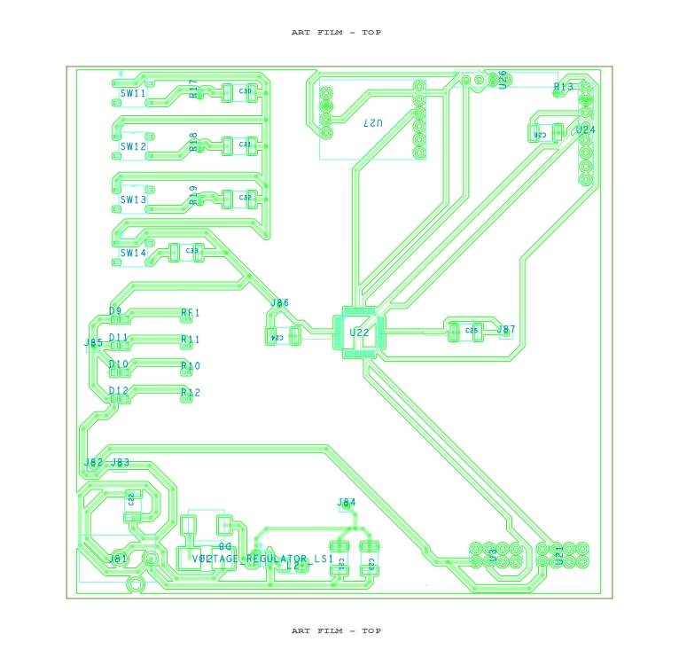
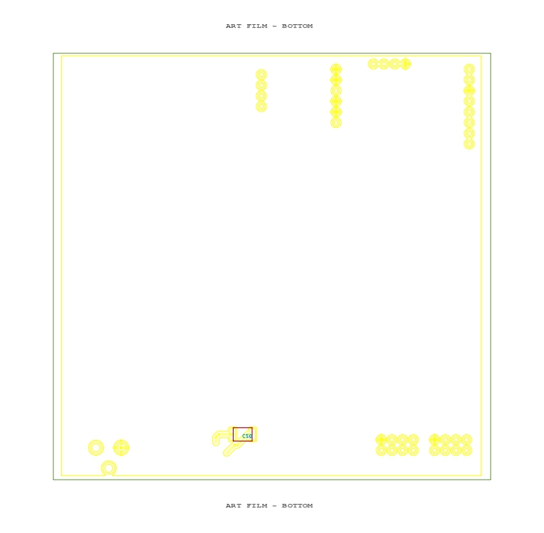
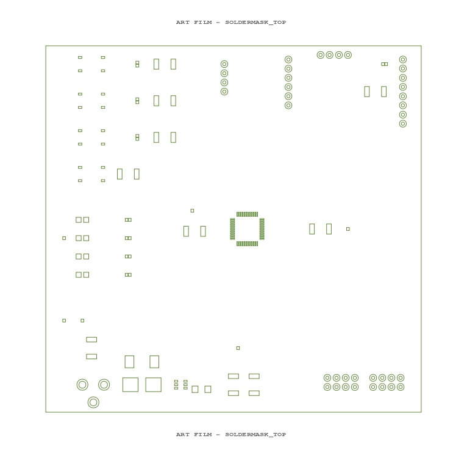
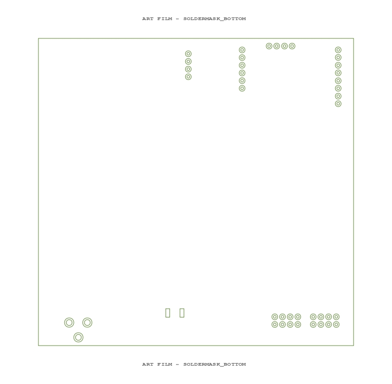
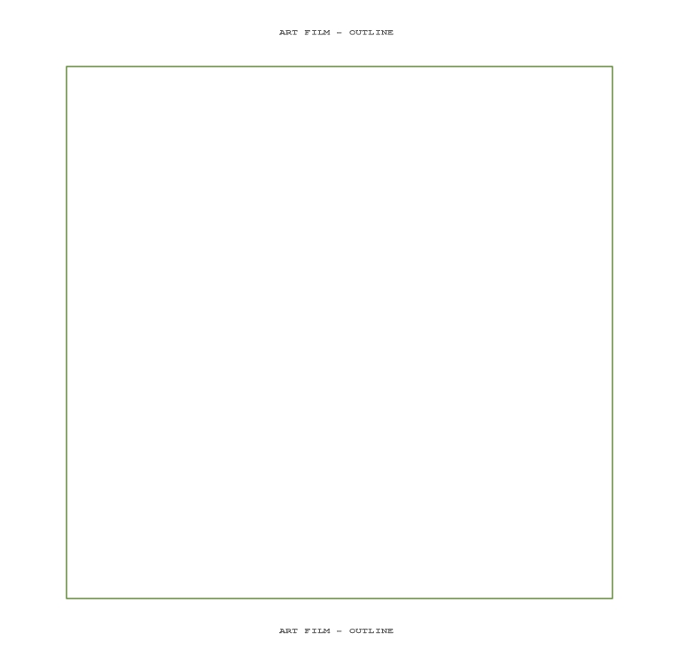

# Sensor & HMI Subsystem — PCB Design

**Lakshanand Sugumar — Team 302 — EGR314 Spring 2026**

---

## Overview

This page documents the PCB design for the Sensor & HMI subsystem. The board is a two-layer design fabricated through the course PCB fabrication process. All components are surface-mount and placed on the top layer. The board operates entirely from a single 3.3 V rail.

---

## PCB Layers

### Top Copper — Art Film TOP

**Figure 01: Top Copper Layer**

The top copper layer carries all signal routing and power distribution. Key design features visible in this layer:

- **PIC18F57K42 (U22, center)** — QFN-48 package placed at the center of the board. All peripheral signal traces fan out from the QFN pad ring. Power and ground pins connect directly to short traces leading to bypass capacitors placed immediately adjacent to the IC.
- **Voltage regulator (VOLTAGE_REGULATOR_LS1, bottom left)** — AP63203WU-7 buck converter placed in the lower-left corner with the inductor and output capacitors in close proximity to minimize switching loop area.
- **Switches (SW11–SW14, top left)** — Four tactile switches grouped along the left edge for easy operator access. Each switch has a dedicated pull-up resistor placed immediately adjacent.
- **LEDs and current-limiting resistors (D9–D12, R10–R13, center left)** — Status LEDs grouped together with series resistors placed in-line between the MCU GPIO and the LED anode.
- **Connectors (J81–J87)** — Ribbon cable connectors and expansion headers placed along the board edges for clean cable routing away from signal traces.
- **I²C pull-up resistors (RF1, R11)** — Placed close to the SDA and SCL lines to minimize stub length on the shared bus.

---

### Bottom Copper — Art Film BOTTOM

**Figure 02: Bottom Copper Layer**

The bottom copper layer is used primarily for through-hole via connections and connector pads. Signal routing is concentrated on the top layer. The sparse bottom layer reflects the all-SMD top-side assembly approach and keeps the board manufacturable with single-side reflow.

---

### Soldermask Top

**Figure 03: Soldermask Top Layer**

The soldermask top layer exposes all SMD pads and connector through-holes. The PIC18F57K42 QFN pad pattern is clearly visible at center. All component pads are correctly opened with no soldermask slivers between fine-pitch QFN pads.

---

### Soldermask Bottom

**Figure 04: Soldermask Bottom Layer**

The soldermask bottom layer exposes through-hole connector pads and vias. The via pattern matches the top copper layer via placement.

---

### Board Outline

**Figure 05: Board Outline**

The board outline defines the physical dimensions of the PCB. The design fits within the course-specified board size constraint.

---

## Design Decisions

**Component placement.** All active ICs are placed on the top layer to allow single-sided reflow assembly. The PIC18F57K42 is centered on the board so that signal traces to all peripherals are approximately equal length and no one group of peripherals requires long routing detours.

**Power regulation placement.** The AP63203WU-7 buck converter and its associated inductor and capacitors are placed in the lower-left corner, away from the IMU and I²C signal traces. This minimizes switching noise coupling into sensitive sensor lines.

**Bypass capacitor placement.** 0.1 µF ceramic bypass capacitors are placed immediately adjacent to each VDD pin on the PIC18F57K42, BNO055, SH1106, and HDC2080. The 22 µF bulk capacitor is placed at the regulator output.

**I²C bus routing.** SDA and SCL traces are kept short and routed together as a pair from the PIC to the sensor and display connectors. Pull-up resistors are placed close to the MCU end of the bus to minimize the stub that the pull-up sees.

**ICSP header placement.** The SNAP programming header is placed along the board edge for easy access during bring-up without requiring the board to be removed from the chassis.

**Switch and LED grouping.** Switches are grouped along the left edge and LEDs are grouped in the center-left area so that operator-facing interface elements are physically separated from the communication and power circuitry on the right and bottom portions of the board.

---

## Downloads

- [Schematic PDF](/docs/08%20-PCB/mosfet_hbridge.pdf)
- [PCB PDF](/docs/08%20-PCB/attempt.pdf)
